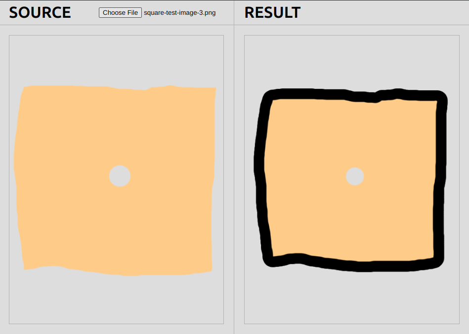

# @devadri/create-sticker

**Library that adds a sticker effect to images with transparent backgrounds.**


> This code was made thanks to [this Stack Overflow answer](https://stackoverflow.com/a/24091727) made by the user [markE](https://stackoverflow.com/users/411591/marke).

Tested with `.png`, `.webp` and `.jpg`.

Customize: `stroke color`, `stroke thickness` and `image padding`.

It uses HTML Canvas, so it only works in the browser (and not in Node.js).


## Install

### Browser

```html
<script src="https://unpkg.com/@devadri/create-sticker@{{ version }}/dist/bundle.iife.js"></script>
```

### npm

```sh
npm install @devadri/create-sticker
```

## Usage

### Browser

```html
<script src="https://unpkg.com/@devadri/create-sticker@{{ version }}/dist/bundle.iife.js"></script>
<script>
  async function modifyImage(img) {
    const stickerImgSrc = await CreateSticker.createSticker(img.src, { strokeWidth: 20, strokeColor: "black", padding: 20 });
    img.src = stickerImgSrc;
  }
</script>
```

### ESM / TypeScript

```ts
import { createSticker } from '@devadri/create-sticker';

async function modifyImage(img) {
  const stickerImgSrc = await createSticker(img.src, { strokeWidth: 20, strokeColor: "black", padding: 20 });
  img.src = stickerImgSrc;
}
```

```ts
import { createSticker, CreateStickerOptions } from '@devadri/create-sticker';

async function modifyImage(img) {
  const options: CreateStickerOptions = {
    strokeWidth: 20,
    strokeColor: "black",
    padding: 20
  }
  const stickerImgSrc = await createSticker(img.src, options);
  img.src = stickerImgSrc;
}
```

### Default options

```json
{
  "strokeWidth": 20,
  "strokeColor": "white",
  "padding": 1
}
```

`padding` minimum values is `1`.


## Demo

Run the demo with the following commands:

```sh
npm run build
npm run demo
```

### Screenshots





## License

[Unlicense license](./LICENSE.md)
